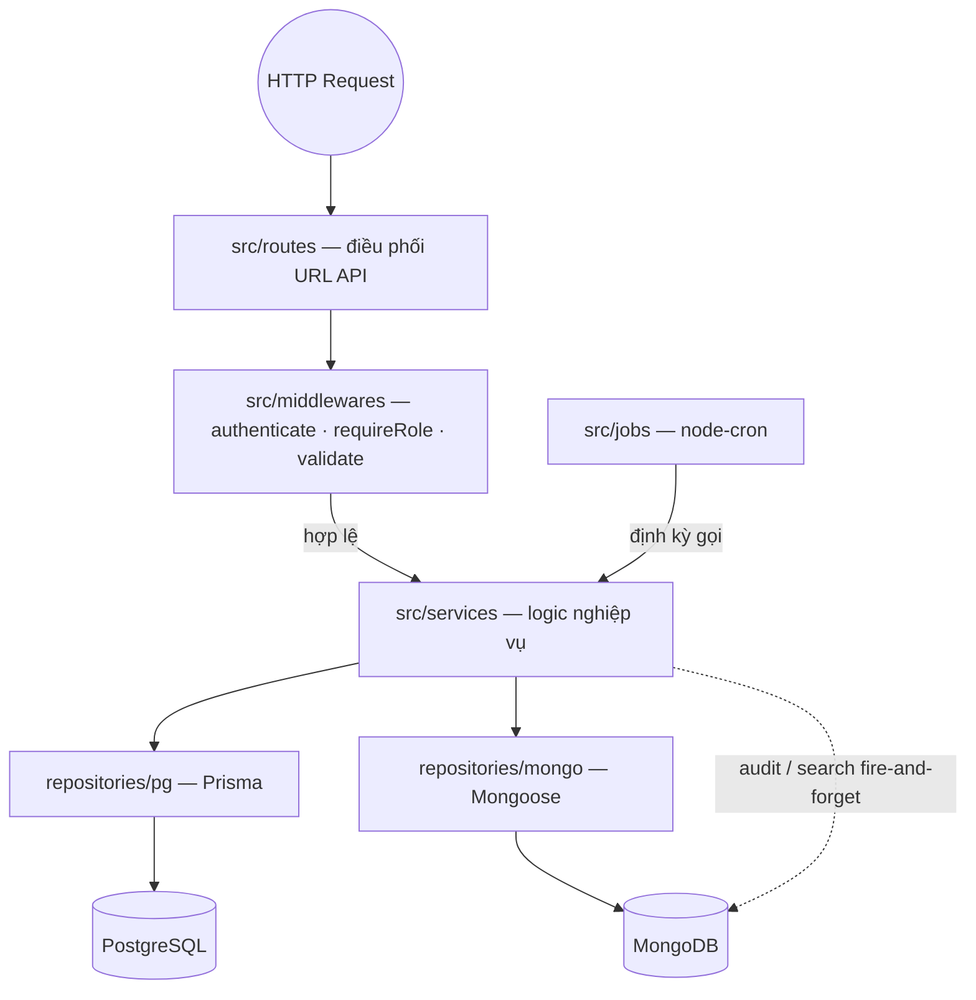
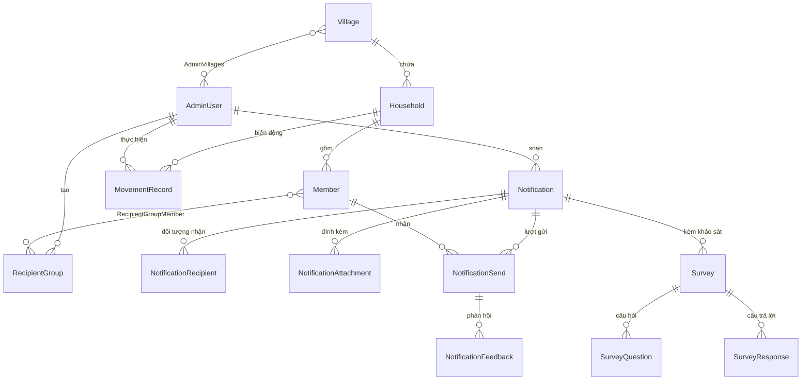
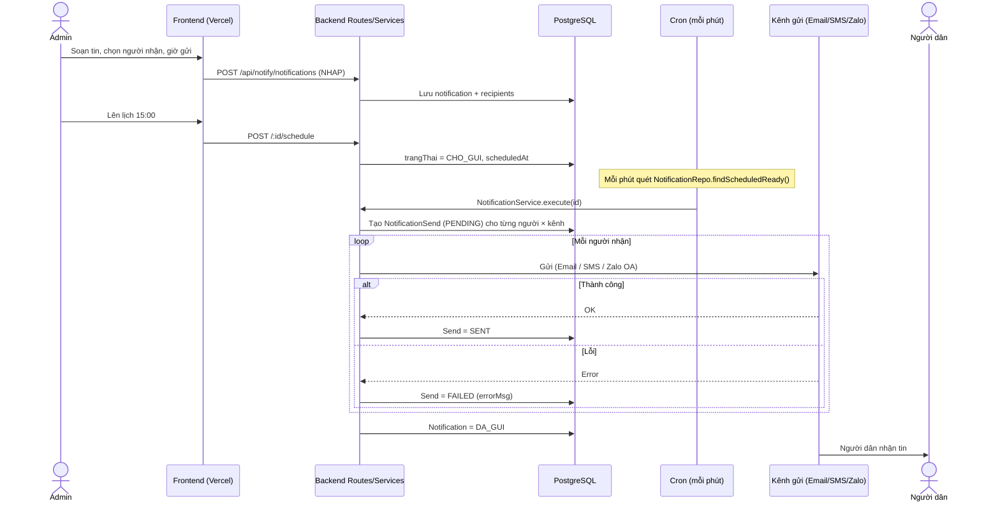

# KIẾN TRÚC HỆ THỐNG — Quản lý hộ dân xã Hoà Tiến

> Tài liệu đặc tả **cấu trúc mã nguồn**, **mô hình dữ liệu** và **phân luồng xử lý** của hệ thống.
> Nội dung được rút trực tiếp từ mã nguồn hiện tại (`backend/` + `Web/admin-dashboard/`), không phải mô tả lý thuyết.
>
> Khuôn mẫu tổng quát để tái sử dụng cho dự án mới: xem [KIEN_TRUC_TEMPLATE.md](KIEN_TRUC_TEMPLATE.md).
> Bộ 5 sơ đồ kỹ thuật (Use Case, Sequence…): xem [system_diagram.md](system_diagram.md).

---

## 1. TỔNG QUAN

Hệ thống gồm 2 phần triển khai độc lập:

| Thành phần | Công nghệ | Triển khai |
|---|---|---|
| **Frontend** (admin dashboard) | React 19 + Vite + Tailwind, React Router | Vercel (HTTPS, auto-deploy từ GitHub) |
| **Backend** (REST API) | Node.js + Express (CommonJS) | VPS Bizfly — Nginx reverse-proxy → Express (PM2) |

**Database — Hybrid (Polyglot Persistence):**

| 🐘 PostgreSQL (Prisma) — *source of truth* | 🍃 MongoDB (Mongoose) — *log / cache / cấu hình* |
|---|---|
| Hộ dân, nhân khẩu, cán bộ, thôn | Audit log (snapshot JSON + diff) |
| Biến động, thông báo, nhóm nhận, khảo sát | Search index (full-text), report cache |
| Quan hệ FK, UNIQUE, transaction (ACID) | Cấu hình & token Zalo OA, event/session Zalo |

**Nguyên tắc vàng:** service **luôn ghi PostgreSQL trước**, sau đó ghi MongoDB (audit/search) kiểu *fire-and-forget* (`.catch(() => {})`). MongoDB lỗi **không** làm hỏng nghiệp vụ chính.

---

## 2. TECH STACK (thực tế từ `package.json`)

**Backend** (Node ≥18):
`express`, `@prisma/client` + `prisma` (PostgreSQL), `mongoose` (MongoDB),
`jsonwebtoken` + `bcryptjs` (auth), `express-validator`, `helmet` + `cors` + `morgan`,
`winston` (log), `node-cron` (job định kỳ), `multer` (upload),
`nodemailer` (Email), `axios` (Zalo/eSMS), `cloudinary`, `@upstash/redis`,
`exceljs` + `pdfkit` (xuất báo cáo).

**Frontend** (`Web/admin-dashboard`):
`react` + `react-dom`, `react-router-dom`, `axios`, Tailwind, `lucide-react`, `recharts`.

---

## 3. CẤU TRÚC THƯ MỤC (thực tế)

```
HOATIEN/
├── backend/
│   ├── server.js                      # entry: middleware → routes → start → cron → graceful shutdown
│   ├── prisma/
│   │   ├── schema.prisma              # 13 model PostgreSQL + 9 enum
│   │   └── seed.js                    # seed admin + danh mục
│   └── src/
│       ├── config/
│       │   ├── env.js                 # đọc & export biến môi trường
│       │   ├── database.js            # connect Prisma + Mongoose (allSettled)
│       │   ├── redis.js               # Upstash Redis client
│       │   └── cloudinary.js          # Cloudinary client
│       ├── routes/                    # 8 file domain + index.js (gộp mount /api)
│       ├── services/                  # 12 service — business logic, điều phối 2 DB + kênh gửi
│       ├── repositories/
│       │   ├── pg/                    # 8 repo Prisma (PostgreSQL)
│       │   └── mongo/                 # 5 repo Mongoose (MongoDB)
│       ├── models/mongo/              # 7 Mongoose schema
│       ├── middlewares/               # auth · validate · error
│       ├── jobs/                      # 3 cron job (node-cron)
│       └── utils/                     # response · logger · diff · normalize · zaloFormat
│
└── Web/admin-dashboard/
    ├── vercel.json                    # rewrite /api + SPA fallback
    └── src/
        ├── App.jsx                    # router + ProtectedRoute
        ├── context/AuthContext.jsx
        ├── layouts/AdminLayout.jsx
        ├── components/                # Header · Sidebar · ui.jsx
        ├── pages/                     # 14 màn hình
        └── services/                  # 7 file gọi axios theo domain + api.js (instance)
```

---

## 4. KIẾN TRÚC 4 TẦNG & PHÂN LUỒNG REQUEST

```
HTTP Request
   │
   ▼
[ server.js ]  helmet → cors → json → morgan → static(/uploads)
   │           app.use("/api", routes)
   ▼
[ Routes ]     validate input · authenticate · requireRole/requireSendPermission
   │           KHÔNG chứa business logic — chỉ điều phối & trả response chuẩn
   ▼
[ Services ]   business logic; điều phối nhiều repo / 2 DB / kênh gửi ngoài
   │
   ▼
[ Repositories ]   pg/ (Prisma)  ·  mongo/ (Mongoose) — chỉ thao tác DB
   │
   ▼
[ Database ]   PostgreSQL  +  MongoDB
   │
   ▼
[ error.middleware ]  notFoundHandler → errorHandler (đặt cuối server.js)
```



### 4.1. Response chuẩn (`utils/response.js`)
Mọi endpoint trả `{ success, message, data }` hoặc `{ success, data, pagination }`.
Helper: `ok` · `created` · `fail` · `notFound` · `unauthorized` · `forbidden` · `paginated`.

### 4.2. Xử lý lỗi (`middlewares/error.middleware.js`)
Map lỗi Prisma → HTTP (`P2025`→404, `P2002`→409, `ValidationError`→422), `err.isOperational`→statusCode tuỳ biến, còn lại → 500.

---

## 5. AUTH & PHÂN QUYỀN (RBAC)

- **JWT** ký bằng `JWT_SECRET`, hết hạn `JWT_EXPIRES_IN` (mặc định `7d`). Mật khẩu hash `bcryptjs`. Không bao giờ trả `passwordHash`.
- Frontend lưu `token` + `user` trong `localStorage`; axios interceptor gắn `Authorization: Bearer`; gặp **401** → xoá token → chuyển `/login`.
- **3 vai trò** (`AdminRole`): `SUPER_ADMIN`, `ADMIN_VILLAGE`, `VIEWER`.
- Middleware (`auth.middleware.js`):
  - `authenticate` — verify token, gán `req.user`.
  - `requireRole(...roles)` — chặn theo vai trò.
  - `requireSendPermission()` — quyền **gửi thông báo** hạt mịn: `SUPER_ADMIN` luôn được; `ADMIN_VILLAGE` cần cờ `canSendNotification = true`; `VIEWER` không bao giờ.

---

## 6. API SURFACE (mount tại `/api`)

| Prefix | File route | Domain |
|---|---|---|
| `/api/auth` | `auth.routes.js` | Đăng nhập, token |
| `/api/villages` | `village.routes.js` | Thôn/xóm |
| `/api/households` | `household.routes.js` | Hộ khẩu |
| `/api/members` | `member.routes.js` | Nhân khẩu |
| `/api/movements` | `movement.routes.js` | Biến động (chuyển đến/đi, tách/gộp) |
| `/api/reports` | `report.routes.js` | Báo cáo, thống kê, xuất Excel/PDF |
| `/api/zalo` | `zalo.routes.js` | Webhook & API Zalo OA |
| `/api/notify` | `notification.routes.js` | Thông báo · nhóm nhận · khảo sát · phản hồi |

Ngoài `/api`: `GET /health`, `GET /` & `GET /zalo_verifier.html` (xác thực domain Zalo), `GET /uploads/*` (file tĩnh đã upload).

**Ví dụ vòng đời 1 thông báo** (`/api/notify/notifications`):
`POST` tạo bản nháp (`NHAP`) → `POST /:id/schedule` (→ `CHO_GUI`) **hoặc** `POST /:id/send` (gửi ngay) → cron/service xử lý → `DA_GUI`. Có thể `POST /:id/cancel` (về `NHAP`) khi đang `CHO_GUI`. Theo dõi qua `GET /:id/sends`.

> Lưu ý: file đính kèm thông báo (`POST /:id/attachments`) hiện lưu **đĩa local** của VPS (`multer` → `/uploads`, phục vụ tĩnh), trong khi client Cloudinary được cấu hình sẵn cho nhu cầu lưu ảnh/file bền hơn.

---

## 7. MÔ HÌNH DỮ LIỆU

### 7.1. PostgreSQL (Prisma — `schema.prisma`)

**Enum:** `Gender`, `HoStatus`, `HoType`, `MemberStatus`, `MovementType`, `RelationType`, `AdminRole`, `NotifStatus`, `SendStatus`, `SurveyQType`.



**Nhóm Hành chính (Giai đoạn 1):**
- `Village` (`villages`) — thôn/xóm; `ma` unique.
- `AdminUser` (`admin_users`) — cán bộ; `role`, cờ `canSendNotification`, quan hệ N–N với `Village`.
- `Household` (`households`) — hộ khẩu; `soHoKhau` unique, `lat/lng`, `trangThai`, `loaiHo`.
- `Member` (`members`) — nhân khẩu; `cccd` unique, `sdt`/`email`/`zaloUserId` (kênh gửi), `laChuHo`.
- `MovementRecord` (`movement_records`) — chuyển đến/đi, gắn `performedBy`.
- `HouseholdRelation` (`household_relations`) — tách (`SPLIT`) / gộp (`MERGE`) hộ.

**Nhóm Thông báo (Giai đoạn 2):**
- `RecipientGroup` (+ `RecipientGroupMember`) — nhóm nhận `MANUAL` hoặc `AUTO` (theo `tieuChi` JSON).
- `Notification` — `trangThai` (`NHAP`→`CHO_GUI`→`DANG_GUI`→`DA_GUI`/`DA_HUY`), `kenhGui[]`, `scheduledAt`.
- `NotificationRecipient` — gắn member **hoặc** group.
- `NotificationAttachment` — file đính kèm.
- `NotificationSend` — **1 bản ghi / người nhận / kênh**; `trangThai` (`PENDING`→`SENT`/`FAILED`/`READ`/`CONFIRMED`).
- `NotificationFeedback` — phản hồi theo từng lượt gửi.
- `Survey` + `SurveyQuestion` + `SurveyResponse` — khảo sát (`SINGLE`/`MULTIPLE`/`TEXT`).

### 7.2. MongoDB (Mongoose — `models/mongo/`)

| Collection | Vai trò |
|---|---|
| `AuditLog` | Snapshot `oldData/newData/diff[]` mọi CREATE/UPDATE/DELETE |
| `SearchIndex` | Chỉ mục full-text đồng bộ từ PostgreSQL (fallback `LIKE` nếu rỗng) |
| `ReportCache` | Cache kết quả báo cáo/thống kê |
| `ZaloConfig` | Cấu hình + access/refresh token Zalo OA (khởi tạo từ `.env`, cron tự refresh) |
| `ZaloEvent` | Log sự kiện webhook Zalo |
| `ZaloSession` | Phiên hội thoại Zalo |
| `Notification` | Bản ghi phụ phục vụ tra cứu/log phía Zalo |

---

## 8. PHÂN LUỒNG NGHIỆP VỤ CHÍNH — Đặt lịch & gửi thông báo



**Đa kênh gửi** (`kenhGui[]` trên `Notification`):
- **Email** — `EmailService` (Nodemailer / Gmail SMTP).
- **SMS** — eSMS.vn (`axios`).
- **Zalo OA** — `ZaloService` gọi `openapi.zalo.me`; token lấy/refresh từ `ZaloConfig` (MongoDB).

Mỗi recipient × mỗi kênh = 1 `NotificationSend` để theo dõi trạng thái độc lập.

---

## 9. CRON JOBS (`node-cron`, khởi động trong `server.js`)

| Job | Lịch | Chức năng | Điều kiện |
|---|---|---|---|
| `scheduledNotifications` | `* * * * *` (mỗi phút) | Quét thông báo `CHO_GUI` đến giờ → `execute` | luôn chạy |
| `zaloTokenRefresh` | `0 3 * * *` (03:00) | Kiểm tra & refresh token Zalo OA nếu gần hết hạn | luôn chạy |
| `syncSearchIndex` | `0 2 * * *` (02:00) | Re-sync toàn bộ search index PostgreSQL → MongoDB | chỉ `NODE_ENV=production` |

Khi khởi động còn gọi `ZaloConfigRepo.initFromEnv()` để nạp token Zalo từ `.env` vào MongoDB (lần đầu).

---

## 10. FRONTEND (`Web/admin-dashboard`)

- **Routing** (`App.jsx`): `/login` công khai; mọi route còn lại bọc trong `<ProtectedRoute>` + `<AdminLayout>` (Sidebar + Header).
- **14 trang** (`pages/`): `Dashboard`, `HoSo`, `ThonXom`, `TinTuc`, `VanBan`, `PhanAnh`, `NhanSu`, `BaoCao`, `CaiDat`, `ThongBao`, `NguoiNhan`, `KhaoSat`, `BaoCaoThongBao`, `Login`.
- **Auth** (`context/AuthContext.jsx`): giữ trạng thái đăng nhập; `ProtectedRoute` chặn khi chưa login.
- **Service layer** (`services/`): mỗi domain 1 file (`authService`, `householdService`, `memberService`, `movementService`, `notificationService`, `reportService`, `villageService`) gọi qua `api.js`.
- **`api.js`**: `baseURL = ${VITE_API_URL || ''}/api`; interceptor gắn JWT; 401 → logout. Để dùng same-origin qua Vercel rewrite, để `VITE_API_URL` rỗng.

---

## 11. MÔ HÌNH DEPLOY

```
Browser ──https──► Vercel (Frontend, auto-deploy GitHub)
                      │  rewrite /api/*  (server-side proxy → tránh mixed-content)
                      ▼
                 VPS Bizfly
                 Nginx :80/443 ──► Express + PM2 :3000   (KHÔNG mở cổng 3000 ra ngoài)
                      │
        Neon (PostgreSQL) · MongoDB Atlas · Upstash Redis · Cloudinary
```

- **Frontend (Vercel):** `vercel.json` rewrite `/api/:path*` → backend + SPA fallback `/(.*) → /index.html`.
  ⚠️ Không trỏ thẳng `VITE_API_URL=http://IP` (trang HTTPS sẽ bị browser chặn mixed-content) — đi qua rewrite của Vercel hoặc backend phải có HTTPS.
- **Backend (VPS):** `git pull && npm install && npx prisma generate && npx prisma db push && pm2 restart`.
  Dự án dùng **`prisma db push`** (không có thư mục `migrations/`). Nginx reverse-proxy mọi request → `localhost:3000`.

### Biến môi trường chính (`config/env.js`)
`PORT`, `NODE_ENV`, `DATABASE_URL` (Neon), `MONGODB_URI` + `MONGODB_DB_NAME`,
`JWT_SECRET` + `JWT_EXPIRES_IN`, `CORS_ORIGINS`,
`ZALO_APP_ID/APP_SECRET/OA_ACCESS_TOKEN/OA_REFRESH_TOKEN/WEBHOOK_SECRET`,
`CLOUDINARY_CLOUD_NAME/API_KEY/API_SECRET`, `UPSTASH_REDIS_REST_URL/TOKEN`,
`SMTP_USER/SMTP_PASS` (Email), `ESMS_API_KEY/SECRET_KEY/BRANDNAME` (SMS).

> Bắt buộc tối thiểu: `DATABASE_URL`, `MONGODB_URI`, `JWT_SECRET` (thiếu sẽ cảnh báo lúc khởi động).

---

*Tài liệu đặc tả kiến trúc dự án Quản lý hộ dân xã Hoà Tiến — cập nhật theo mã nguồn hiện hành.*
