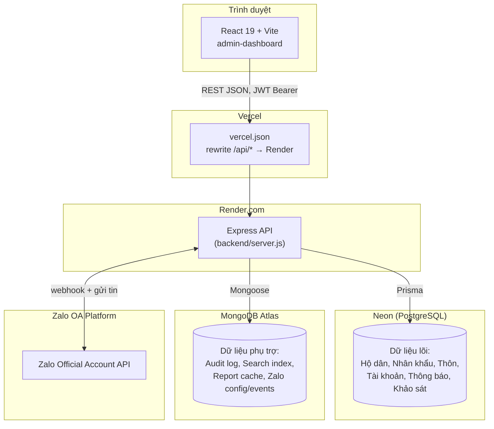
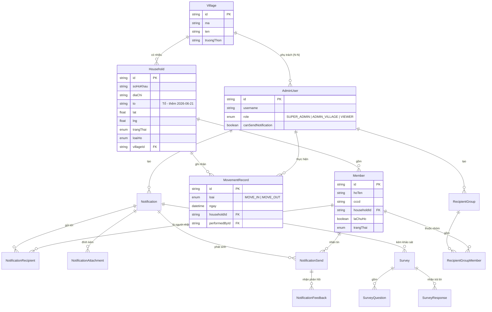
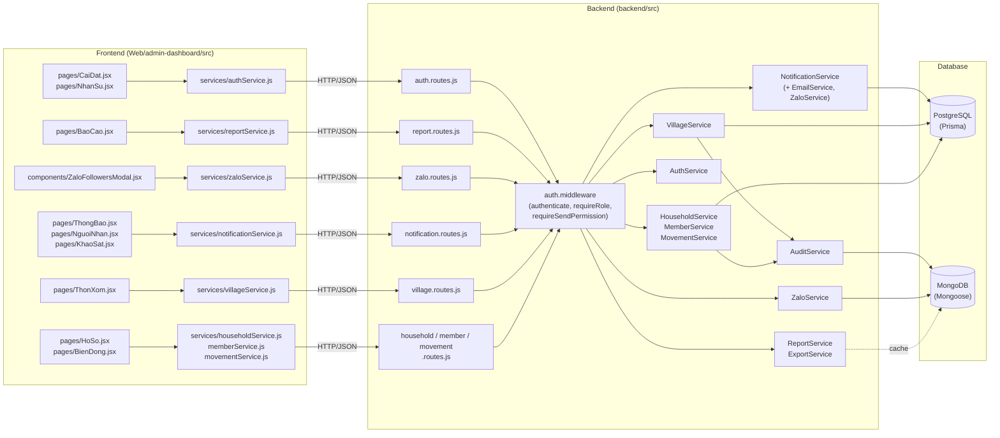
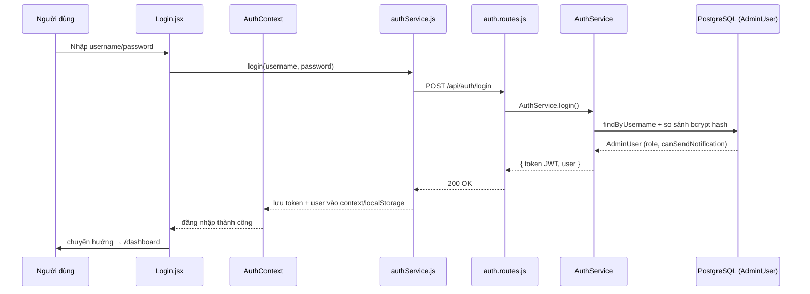
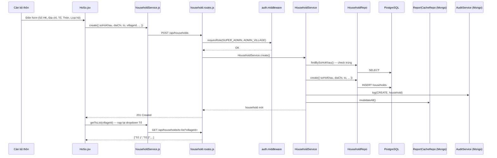
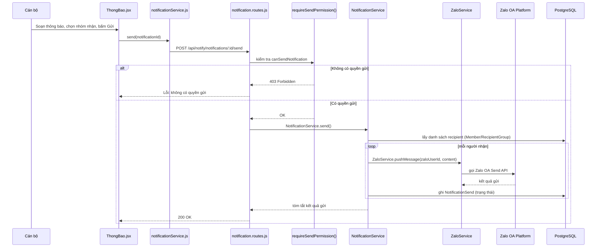
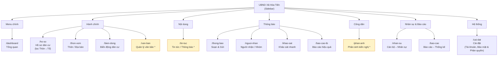
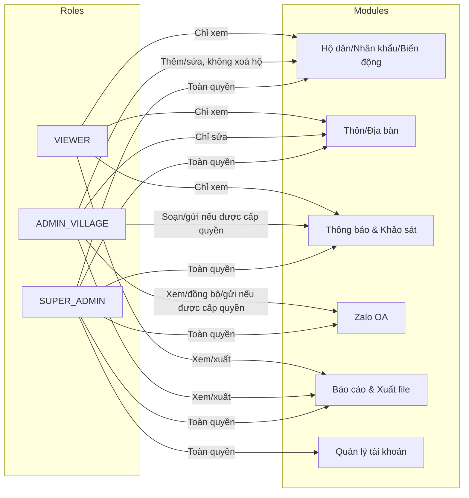

# Sơ đồ kiến trúc & luồng dữ liệu — Dự án TIENICHOAZALO_HOATIEN

> Toàn bộ sơ đồ dùng cú pháp **Mermaid** — render trực tiếp trên GitHub, GitLab, VS Code (extension Markdown Preview Mermaid) hoặc https://mermaid.live. Nội dung khớp 1:1 với [GraphRAG_DuAn.md](GraphRAG_DuAn.md).

## 1. Kiến trúc tổng thể (Deployment)

## 2. Sơ đồ ERD — PostgreSQL (Prisma)

`HouseholdRelation` (tách/gộp hộ) không có quan hệ Prisma chính thức tới `Household` — chỉ lưu `sourceId`/`targetId` dạng string tự do, nên không vẽ trong ERD ở trên; xử lý logic nằm hoàn toàn ở `HouseholdService.splitHousehold()` / `mergeHouseholds()`.

## 3. Sơ đồ thành phần Frontend ↔ Backend ↔ Database

## 4. Luồng đăng nhập & xác thực (Sequence)

## 5. Luồng "Thêm hộ dân" kèm phân loại Thôn/Tổ (Sequence — cập nhật 2026-06-21)

## 6. Luồng gửi thông báo qua Zalo (Sequence)

## 7. Bản đồ điều hướng Sidebar (Site map)

`*` = trang chưa nối API thật (UI tĩnh/mock) — xem mục 2.8 trong [GraphRAG_DuAn.md](GraphRAG_DuAn.md).

## 8. Ma trận phân quyền (trực quan hoá)

