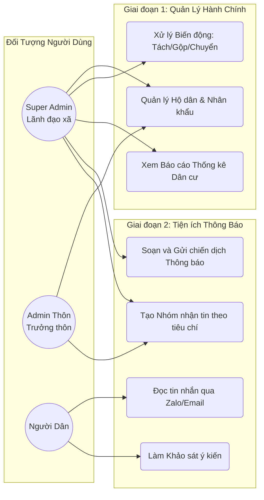
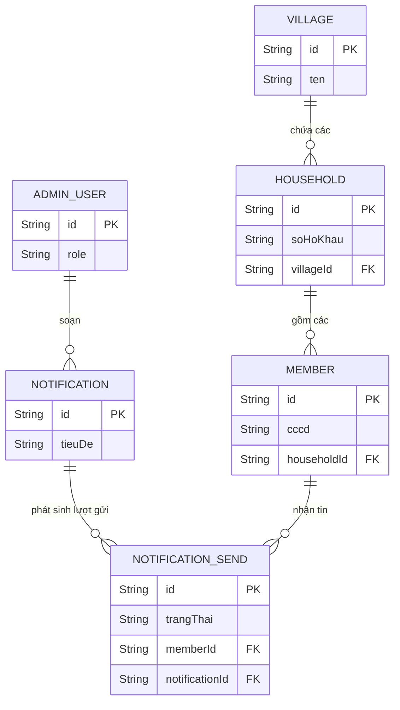
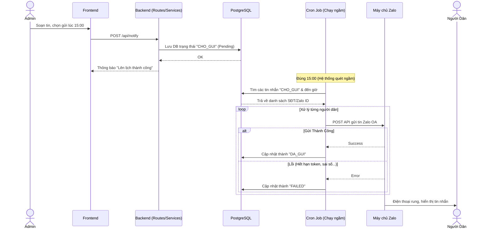
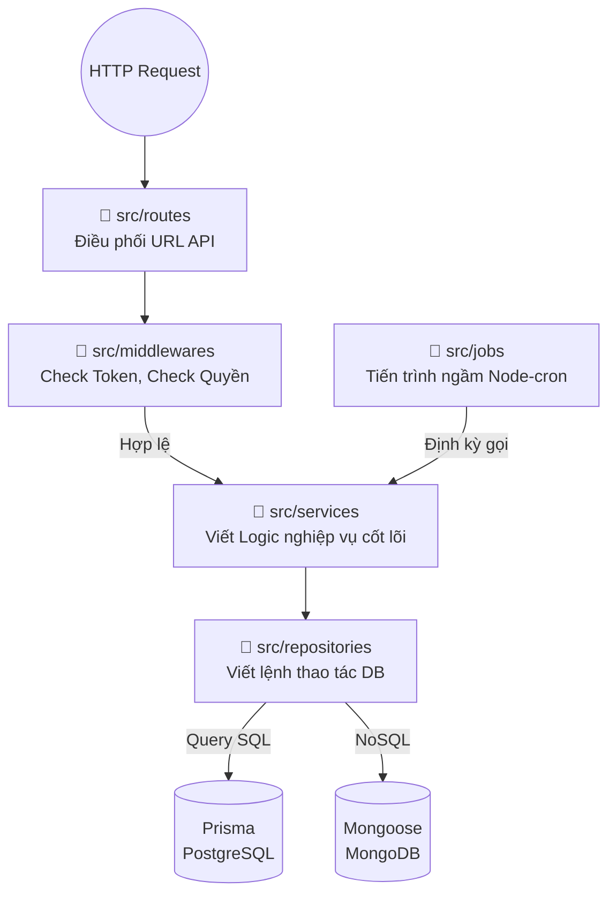

# Bộ Sơ Đồ Kỹ Thuật Toàn Diện - Dự án Hoa Tiến

Để một người mới (hoặc hội đồng nghiệm thu) nhìn vào là có thể hiểu **toàn bộ dự án từ tổng quan nghiệp vụ đến chi tiết code chạy như thế nào**, ngành phần mềm có một bộ 5 sơ đồ chuẩn. Dưới đây là bộ sơ đồ đầy đủ nhất cho hệ thống của bạn:

---

## 1. Sơ đồ Kiến trúc Tổng thể (System Architecture Diagram)
*Mục đích: Giúp hiểu hệ thống chạy trên nền tảng nào, hạ tầng ra sao.*

```mermaid
graph TD
    %% Người dùng và Giao diện
    USER["Người Quản Trị (UBND)"] -->|Thao tác web| UI["Frontend\n(React/Vercel)"]
    CITIZEN["Người Dân"] -->|Nhận & Phản hồi| ZALO_APP["App Zalo / Email"]
    
    %% Luồng API
    UI -->|Gọi API (REST)| BE["Backend API\n(Node.js / Express trên Bizfly VPS)"]
    ZALO_APP -->|Webhook phản hồi| BE
    
    %% Cơ sở dữ liệu (Hybrid)
    subgraph Lưu Trữ (Databases)
        BE -->|Ghi dữ liệu lõi\n(Prisma)| PG[("PostgreSQL\n(Hộ dân, Cán bộ, Lịch sử)")]
        BE -->|Ghi log/cấu hình\n(Mongoose)| MG[("MongoDB\n(Audit Log, Zalo Token)")]
    end
    
    %% Kênh tương tác bên ngoài
    subgraph Các kênh gửi thông báo
        BE -->|Gọi API| ZALO_OA["Zalo OA API"]
        BE -->|SMTP| EMAIL_SERVER["Email SMTP"]
    end
    
    ZALO_OA --> ZALO_APP
    EMAIL_SERVER --> ZALO_APP
    
    CRON["Cron Jobs\n(Chạy ngầm mỗi phút)"] -->|Tự động kích hoạt| BE
```

---

## 2. Sơ đồ Use Case (Nghiệp vụ)
*Mục đích: Giúp hiểu Hệ thống này làm được gì và Ai là người dùng chức năng đó.*



---

## 3. Sơ đồ Quan hệ Cơ sở dữ liệu (ERD)
*Mục đích: Giúp đội Database hiểu các bảng dữ liệu móc nối với nhau qua ID như thế nào.*



---

## 4. Sơ đồ Tuần tự (Sequence Diagram) - Luồng chạy Code
*Mục đích: Giúp Coder hiểu logic code đằng sau tính năng quan trọng nhất - Đặt lịch gửi Zalo.*



---

## 5. Sơ đồ Cấu trúc Mã nguồn (Backend Component)
*Mục đích: Khi có lỗi, lập trình viên nhìn vào đây để biết cần mở thư mục nào trong VS Code để sửa.*


